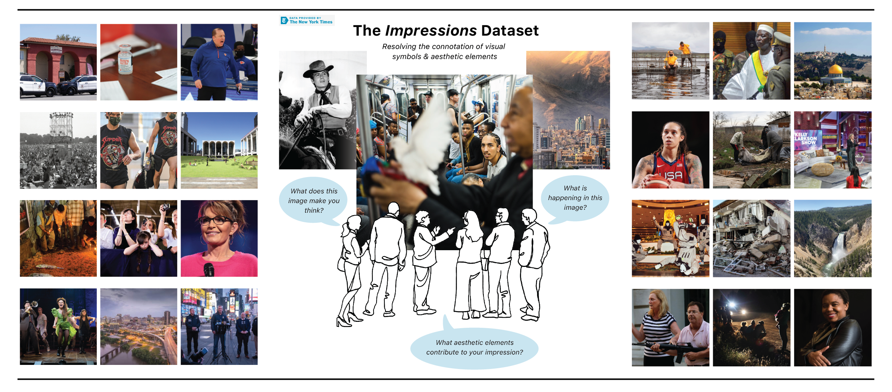

# Impressions
Dataset for the investigation of visual semiotics, and how specific visual features and design choices can elicit specific emotions, thoughts and beliefs.

<p align="center">
    
<p>

Shield: [![CC BY-NC-SA 4.0][cc-by-nc-sa-shield]][cc-by-nc-sa]

This work is licensed under a
[Creative Commons Attribution-NonCommercial-ShareAlike 4.0 International License][cc-by-nc-sa].

[![CC BY-NC-SA 4.0][cc-by-nc-sa-image]][cc-by-nc-sa]

[cc-by-nc-sa]: http://creativecommons.org/licenses/by-nc-sa/4.0/
[cc-by-nc-sa-image]: https://licensebuttons.net/l/by-nc-sa/4.0/88x31.png
[cc-by-nc-sa-shield]: https://img.shields.io/badge/License-CC%20BY--NC--SA%204.0-lightgrey.svg

<p align="center">
    
<p>

The **Impressions dataset** is a multimodal benchmark that consists of 4,300 unique annotations and over 1,440 image-caption pairs from the photography domain. Each annotation explores (1) the aesthetic impactfulness of a photograph, (2) image descriptions in which pragmatic inferences are welcome, (3) emotions/thoughts/beliefs that the photograph may inspire, and (4) the aesthetic elements that elicited the expressed impression.

EMNLP 2023 | [Paper](https://arxiv.org/abs/2310.17887)

### Data Locations

- **metadata**
    - **all_image_annotations.csv** : All annotations on image impact, description, perception, and aesthetic evaluation.
    - **image_annotations_3cap.csv** : Annotation set where image-caption pair have 3+ annotations from 3 distinct annotators.
    - **mean_impact_scores.csv** : Mean aesthetic impact scores for all images evaluated during data collection. Scores range from 1 (highly impactful) to 4 (not impactful).
    - **annotator_personality_data.csv** : Annotator answers to a compact version of the Big 5 Personality test.
    - **annotator_demographic_data.csv** : Annotator demographic information.

### Impressions Media

To download all images of the Impressions dataset, please run:

```
python download_images.py
```